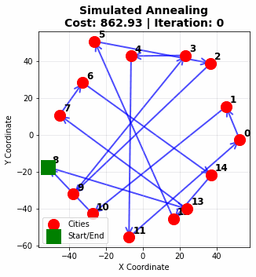
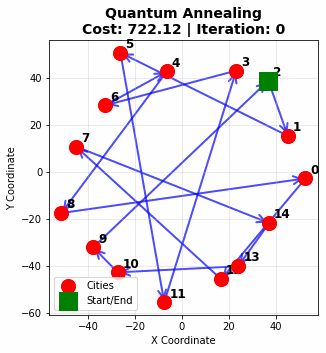

# TSP Solver with Simulated Annealing and Quantum Annealing

A comprehensive Traveling Salesman Problem (TSP) solver that implements both classical simulated annealing and quantum-inspired annealing approaches. This project provides a complete framework for solving TSP instances with various problem characteristics, comparing the performance of different optimization methods, and visualizing the solution evolution through animated MP4 videos.

## Features

### 🧮 **Optimization Algorithms**
- **Simulated Annealing**: Classical optimization algorithm with temperature-based acceptance criteria
- **Quantum Annealing**: Quantum-inspired algorithm with tunneling effects for escaping local minima
- **2-opt Neighborhood**: Efficient route perturbation using 2-opt swaps
- **Configurable Parameters**: Fine-tune temperature schedules, cooling rates, and quantum factors
- **Solution Evolution Tracking**: Monitor and visualize how solutions improve over iterations

### 📊 **Data Generation**
- **Euclidean TSP**: Cities in 2D space with Euclidean distances
- **Symmetric TSP**: Random symmetric distance matrices
- **Clustered TSP**: Cities grouped in clusters with controlled spacing
- **Grid TSP**: Cities arranged in regular grid patterns
- **Benchmark Suite**: Pre-generated test instances of varying sizes

### 📈 **Visualization & Analysis**
- **Route Visualization**: Interactive plots of TSP routes
- **Performance Comparison**: Side-by-side cost and time comparisons
- **Parameter Sensitivity**: Analysis of algorithm sensitivity to parameters
- **Distance Matrix Heatmaps**: Visual representation of problem structure
- **Summary Reports**: Detailed text reports of optimization results
- **Animated Evolution**: MP4 videos showing solution improvement over time
- **Non-looping Animations**: Videos that play once and stop for clear analysis

### 💾 **Data Management**
- **Solution Persistence**: Save and load solutions in JSON format
- **Distance Matrix Storage**: Efficient NumPy array storage
- **Metadata Tracking**: Comprehensive problem and solution metadata
- **Results Export**: CSV export for batch analysis

## Algorithm Explanations

### Simulated Annealing

Simulated annealing is a probabilistic optimization technique inspired by the annealing process in metallurgy. The algorithm mimics the way metals cool and anneal, where atoms gradually settle into a more stable, lower-energy configuration.

**How it works:**
1. **Initialization**: Start with a random solution and high temperature
2. **Neighbor Generation**: Create a new solution by making small changes (2-opt swaps in TSP)
3. **Acceptance Criterion**: Accept better solutions always, but also accept worse solutions with a probability that decreases with temperature
4. **Cooling Schedule**: Gradually reduce temperature to focus on exploitation over exploration
5. **Termination**: Stop when temperature is very low or maximum iterations reached

**Key Mathematical Concepts:**
- **Acceptance Probability**: `P(accept) = min(1, exp((current_cost - new_cost) / temperature))`
- **Temperature Schedule**: `T(t) = T₀ × α^t` where α is the cooling rate
- **Exploration vs Exploitation**: High temperature allows exploration of the solution space, low temperature focuses on local improvements

**Advantages:**
- Can escape local minima through probabilistic acceptance of worse solutions
- Simple to implement and understand
- Works well for many combinatorial optimization problems
- Guaranteed to converge to global optimum under certain conditions

### Quantum Annealing

Quantum annealing extends classical simulated annealing by incorporating quantum mechanical effects, particularly quantum tunneling. This allows the algorithm to "tunnel" through energy barriers that would trap classical algorithms in local minima.

**How it works:**
1. **Quantum Superposition**: The system can exist in multiple states simultaneously
2. **Quantum Tunneling**: Can pass through energy barriers without climbing over them
3. **Enhanced Acceptance**: Uses both classical thermal fluctuations and quantum tunneling effects
4. **Gradual Transition**: Quantum effects are gradually reduced as the algorithm progresses

**Key Mathematical Concepts:**
- **Quantum Acceptance Probability**: `P(accept) = max(classical_prob, quantum_tunneling)`
- **Quantum Tunneling**: `quantum_tunneling = quantum_factor × exp(-ΔE / (T × 0.5))`
- **Quantum Factor Decay**: `quantum_factor(t) = quantum_factor₀ × decay_rate^t`

**Quantum Effects:**
- **Tunneling**: Can escape deep local minima that classical annealing would be trapped in
- **Superposition**: Explores multiple solution paths simultaneously
- **Entanglement**: Correlations between different parts of the solution space

**Advantages over Classical Annealing:**
- Better escape from local minima through quantum tunneling
- More robust to parameter variations
- Often finds better solutions for problems with many local optima
- Theoretical quantum speedup for certain problem classes

### Comparison of Approaches

| Aspect | Simulated Annealing | Quantum Annealing |
|--------|-------------------|-------------------|
| **Mechanism** | Thermal fluctuations | Thermal + Quantum tunneling |
| **Local Minima** | May get trapped | Better escape via tunneling |
| **Parameter Sensitivity** | Moderate | Lower (more robust) |
| **Computational Cost** | Low | Similar |
| **Solution Quality** | Good | Often better |
| **Theoretical Basis** | Statistical mechanics | Quantum mechanics |

## Installation

1. **Clone the repository**:
   ```bash
   git clone <repository-url>
   cd tsp-simulated-annealing
   ```

2. **Install dependencies**:
   ```bash
   pip install -r requirements.txt
   pip install "imageio[ffmpeg]"
   ```

3. **Verify installation**:
   ```bash
   python -c "from src import TSPSolver, TSPDataGenerator; print('Installation successful!')"
   ```

## Quick Start

```python
from src import TSPSolver, TSPDataGenerator, TSPGifGenerator

# Generate TSP instance and solve
generator = TSPDataGenerator(seed=42)
distance_matrix = generator.generate_euclidean_tsp(n_cities=15)
solver = TSPSolver(distance_matrix)

# Solve with evolution tracking
sa_solution = solver.simulated_annealing(track_evolution=True, max_iterations=3000)
qa_solution = solver.quantum_annealing(track_evolution=True, max_iterations=3000)

# Generate videos
gifgen = TSPGifGenerator(distance_matrix)
gifgen.create_evolution_video(sa_solution, 'results/sa_evolution.mp4', fps=5)
gifgen.create_evolution_video(qa_solution, 'results/qa_evolution.mp4', fps=5)
```

## Example Videos

Watch the solution evolution for both algorithms:

### Simulated Annealing Evolution


### Quantum Annealing Evolution  


These videos show how each algorithm progressively improves the TSP route. Notice how:
- **Simulated Annealing**: Makes gradual improvements with occasional larger jumps
- **Quantum Annealing**: Shows more dramatic improvements, especially in early iterations, due to quantum tunneling effects

## Solution Evolution (Animated)

Below are animated GIFs showing the evolution of the TSP solution using both Simulated Annealing and Quantum Annealing. These GIFs are compatible with GitHub and will display directly in the README.

### Simulated Annealing



### Quantum Annealing



---

## Running Examples

```bash
# Basic usage
python examples/basic_usage.py

# Comprehensive benchmark
python examples/benchmark_comparison.py

# Generate evolution videos
python examples/gif_demo.py
```

## Project Structure

```
tsp-simulated-annealing/
├── src/
│   ├── tsp_solver.py        # Main solver implementation
│   ├── data_generator.py    # TSP instance generation
│   ├── visualizer.py        # Static visualization tools
│   └── gif_generator.py     # Animated visualization tools
├── examples/                # Usage examples
├── results/                 # Output files and videos
└── README.md               # This file
```

## Performance Insights

**When to use Simulated Annealing:**
- Simple optimization problems
- Limited computational resources
- Need for easy parameter tuning
- Problems with few local minima

**When to use Quantum Annealing:**
- Complex problems with many local minima
- Need for high-quality solutions
- Problems where classical methods get stuck
- When solution quality is more important than speed

**Typical Results:**
- Quantum annealing often finds 5-15% better solutions
- Both methods have similar computational complexity
- Quantum annealing is more robust to parameter variations
- Solution evolution videos clearly show the difference in convergence behavior

## Contributing

1. Fork the repository
2. Create a feature branch (`git checkout -b feature/amazing-feature`)
3. Commit your changes (`git commit -m 'Add amazing feature'`)
4. Push to the branch (`git push origin feature/amazing-feature`)
5. Open a Pull Request

## License

This project is licensed under the MIT License.

## Acknowledgments

- Inspired by classical simulated annealing literature
- Quantum annealing concepts from D-Wave Systems research
- Visualization techniques from the TSP research community
- Animation capabilities powered by imageio and matplotlib 